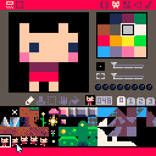

I'd been meaning to write for my blog, since I'm now posting more regularly on Twitter, and am fairly active in a few Discord chats. Most of what I've been doing lately has been centered around fantasy consoles.

## Fantasy Consoles?

While there are differing opinions on exactly what constitutes a fantasy console, the basic idea is that it's a game development platform for hardware that doesn't exist. In some cases, there are entire systems dedicated to maintaining the illusion that somewhere in an alternative universe, these video game consoles could have existed.

## Why Fantasy Consoles?

The most appealing aspect of developing on these platforms is the artificially-imposed constraint that working within a proscribed set of parameters affords. That's a mouthful, but it'd probably be simpler to explain the idea with some practical examples.

Let's take the first and probably most well-known fantasy console out there, Pico-8. If the Pico-8 system were a real console, it would have lower color specs and resolution than a Game Boy Color with two less buttons. Its specs are as follows:

**Display resolution:** 128×128 pixels, 16 pre-set colors (through an additional palette 16 additional colors [have been discovered](https://www.lexaloffle.com/bbs/?tid=35253))  
**Audio:** 4-channel "bloops" (basic FM synthesis) simultaneous  
**Input:** Up to 4 six-button gamepads  
**Memory:** Up to 32k for each cartridge  
**Language:** Customized version of Lua  

Cartridges for this platform are stored in the lower bits of the color channels in a standard PNG image, so the "cartridge" file actually contains all the relevant game data. The system itself comes with a feature to browse finished games, so Pico-8 can be used as a standalone console.

While you'd think that being limited to 128×128 pixels with only 16 colors at a time is fairly limiting, the community itself has made the platform an overwhelming success, and they continue to push out amazing games using a highly constrained format.

Some example Pico-8 games (click each to visit)

## More Fantasy Consoles

Since Pico-8, there have been a slew of other fantasy consoles released, some with similar design goals, and some that are completely esoteric. I am currently maintaining a (mostly up-to-date) list of [all the fantasy consoles I can find](http://homebrew.pixelbath.com/wiki/Fantasy_console) (let me know if I'm missing yours!). I've also helped a couple [other people](https://gardrek.itch.io/vvpet) with [their systems](https://torbuntu.itch.io/leikr), and learned some different programming languages on the way.

## Resources

If you need help getting started, check out the [fantasy console list](http://homebrew.pixelbath.com/wiki/Fantasy_console). If you're looking for a well-established product with tons of community support, I really can't recommend Pico-8 enough. It's not free (at $14.99), but it's one of the more polished systems out there.

My personal fantasy console recommendations are as follows:

* [Pico-8](https://www.lexaloffle.com/pico-8.php) ($14.99) - The original. Has a huge community following, and is the origin of #tweetcart.
* [TIC-80](https://tic80.com/) (free) - This project came out almost directly on the heels of Pico-8. It has similar, but far less constraints, with a low barrier to entry.
* [PixelVision 8](https://www.pixelvision8.com/) (free) - A system that lets you design your own constrained system, then make a game for it.

To discuss with other like-minded individuals, check out these Discord servers:

* [Pico-8](http://discord.gg/EwQ86eq) - Useful for things other than Pico-8, but mostly centered around Pico-8.
* [Fantasy Consoles](https://discord.gg/SGvzhgs) - Includes most other smaller fantasy console channels. 

## Making Games

And finally, what blog post would be complete without a little self-promotion? While working on the Leikr fantasy console, I turned a small demo into a "full" Flappy Bird style clone! The gameplay isn't much to be impressed about, but all assets in the game were made by me: graphics, code, sounds, and music.

[Play FlappyBirb here](https://pixelbath.itch.io/flappybirb-leikr)!