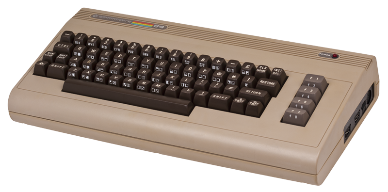
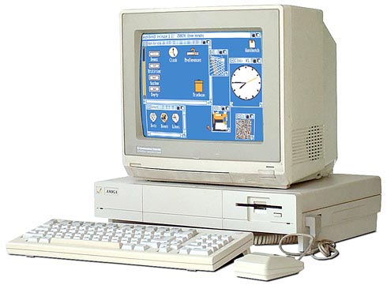

## About

This is the personal website of Michael Hoskins, a designer and programmer located in Northwest Montana.

### Work
In past years, I've managed PC vendor support and sales for a small business, been employed as a programmer and designer, and consulted for corporations in the oil & gas and cable media industries. For about the last decade, I've held administrative/managerial positions related to graphics and development.

I'm available for freelance requests on an ongoing basis, provided I am not too busy with current assignments. Projects that push boundaries and expand my knowledge are of particular interest. Send me an email at <span class="email"></span> by accessing my [contact](/contact/) page. My current focus is on the following: Blender, 3ds max, After Effects animation, Illustrator, Photoshop, Android/iOS apps, PHP, Javascript, jQuery, and WordPress themes and plugins. Be sure to check out my [work](/work/) page for samples.

### Play
I've been a lover of video games for almost as long as I can remember, and an avid programmer for nearly as long. In elementary school, one of our classes had a [TI-99/4A](http://en.wikipedia.org/wiki/Texas_Instruments_TI-99/4A) with a few games on it. From that moment on, I was captivated by the capabilities of computers and the potential they contained for entertainment.

<div class="image-caption alignleft">
The "Breadbox"
</div> Sometime around third or fourth grade, I received a second-hand Commodore 64 (with disk and tape drives!), along with a couple programming manuals for the system. As it turned out, these would be instrumental in showing me the computer not just as a consumer device, but as something that could be commanded to carry out the user's will (provided you could learn the syntax). These manuals, along with the magazine *[3-2-1 Contact](http://en.wikipedia.org/wiki/3-2-1_Contact#The_magazine)*, taught me the basics of BASIC which came in handy during the Apple IIe-era of school computing. I believe before the class even started, I'd already wowed the person next to me with my fancy:

```basic
10 PRINT "MICHAEL IS COOL."
20 GOTO 10
```

We learned to use [LOGO](https://en.wikipedia.org/wiki/Logo_(programming_language)), but the pen-based drawing didn't make much sense to me at the time. Why use such a slow method of drawing when you could just jam everything into a sprite and blit it anywhere you want? Anyway, after middle school I didn't do much with computers. <div class="image-caption alignright">
How do I love thee? Let me `set count <theways$1000>`
</div> I occasionally used a friend's Amiga 1000 (with RAM expansion and **two** floppy drives, thank you very much) as often as I could, checking out the newest games along with its thriving demo scene. After high school, I moved to Houston, and began to reap the benefits that urban living brings. Now able to get a reliable and fairly cheap Internet connection, I began a new obsession: to *learn*. I was determined to soak up any new technology that the web had to offer.

During this period I began to learn HTML, and while helping others with specific needs for their sites, began to pick up some ASP (at the time, Microsoft products were trivially easy to begin developing with, unlike the Rubies and Railcars of today), and then PHP. I was tempted by the versatile allure of Java and its oft-repeated "Write-Once-Run-Anywhere!" mantra, but didn't understand what all those extra words meant: "Public static void main? That's ridiculous; why can't I just write the function name?"

Ultimately, after getting my feet wet in a few more semicolon-based languages, I finally understood Java's now-not-so-cryptic code, but had already graduated to a career in Flash Actionscript development. Fun graphics, easy framework, ubiquitous player...what's not to like?

This brings us close to the present. I've learned a great many languages and skills since my start in hacking (in the "coding" sense), and will likely be learning more in the future. I've now worked with c#/ASP.Net, SQL Server, Windows Domain/AD administration, Python, and Linux, along with design programs such as InDesign, Photoshop, After Effects, Illustrator, and Blender.

I enjoy tackling new problems and pushing my boundaries, which allows me to learn new skills as well as apply my current knowledge in new ways.
