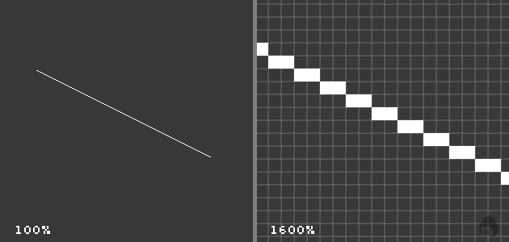
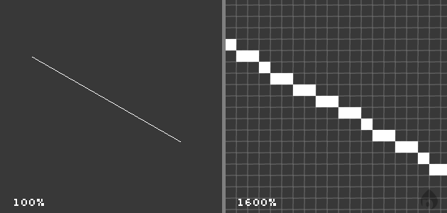
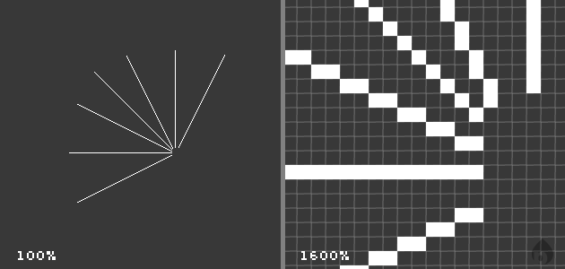
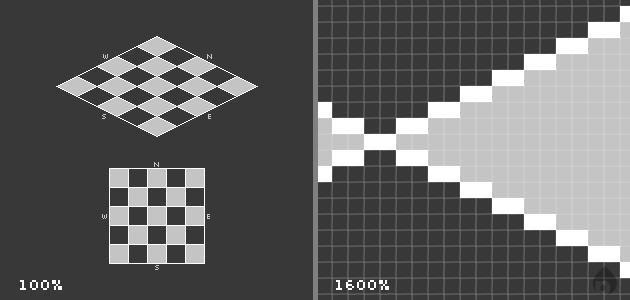
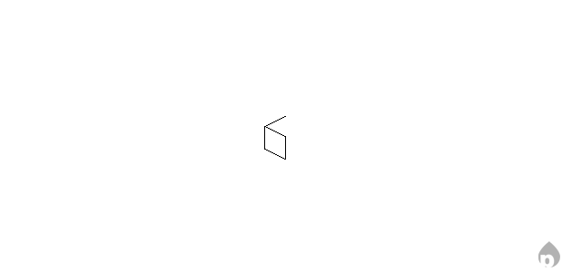
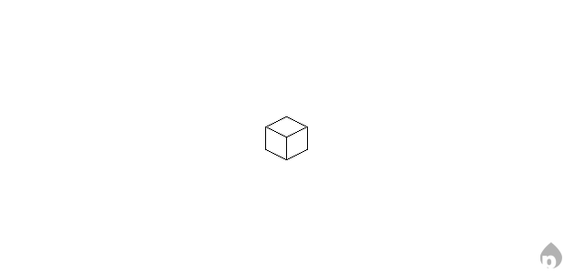

# Chapter 2: Basic Pixel Art

<!-- TOC -->

### The Basic Isometric Line

The most important element you need to know about in isometric art is how the basic line works. What truly makes isometric art is the scale and orientation of the linework. Without touching too much on theory behind isometric perspective, here is how to draw a basic isometric straight line:

2.1: The isometric line.

When viewed at 100%, the line appears straight and clean. When we zoom in closer, the structure of the line becomes clear.

You're probably noticing that this pattern is pretty basic. All simple isometric lines such as the above example have a simple rule you should always follow for clean results: you will always be drawing pixels at a 2:1 ratio. For example, in the above line starting from the top, pixels are drawn 2 to the right, then 1 down.

The 2:1 rule uses this basic concept of every single pixel drawn in any direction, moving across two pixels in the perpendicular direction. If you're looking at this line from a birds' eye view straight down, it would appear straight up and down, or vertical.

In our isometric drawing, the perspective of this line works out to 26.565&deg;, which is unimportant for our purposes. True isometric projections use lines at 30&deg;, but not only will this make our drawings appear stretched vertically, it's incredibly difficult to work with. The next example is 30&deg;, and while it _almost_ looks decent, it's not straight and will look poor when used across an entire drawing.

2.2: A true 30&deg; line, but too ugly for our needs.

There are exceptions to our perpendicular line rule, but they are mostly special cases, and you will learn later when they are most useful. Note in figure 1.3 below that all the lines aside from the purely vertical, horizontal, and diagonal lines, all of them are using the 2:1 rule.

2.3: Different isometric line angles.

### The Isometric Grid

An isometric plane can be divided up into a series of squares that have been joined together to form a larger square. The below image shows us how a normal 2D grid is turned into an isometric grid. The normal grid has simply been moved around, as if it were in a 3D space, so that the view has changed to an isometric view of the plane. Note that the lines do not converge, as in a normal perspective drawing. In isometric drawings, there is no "horizon," so there is no vanishing point, and consequently no "true" 3D perspective.

2.4: The top-down, standard grid becomes isometric. Note the 2:1 usage.

### Creating Your First Isometric Cube

The first thing to do is create a new layer for the artwork. Working on the background layer limits our ability to move elements around easily and quickly. You can click the New Layer button ( on the Layers panel), .

We'll start with an outline. The simplest way to outline an isometric shape is to think if it in two dimensions, skewed into a three dimensional perspective. Draw one side of the cube using the [2:1 lines discussed earlier][1].

We'll start with a plain line the width of our upcoming cube. Keep to the 2:1 pixel ratio.

2.7: The first edge of the cube starts with a line.

Use this line to determine the lengths of the remaining lines. Draw the top line at the height you want your cube. Feel free to copy, then paste, the first line we drew for the top parallel line. Optionally, you can re-duplicate this line and flip it vertically to create the back edge shown above. Pixel art is tedious enough that you should strive to keep your repetitive tasks to a minimum.

2.8: One half of one cube gleamed.

Once you've got a full half of the cube drawn, merge any pasted layers together. Make sure you do not merge the cube into the background layer, or you're going to make more work for yourself shortly. Select the entire canvas with Ctrl+A (⌘+V on Mac) and immediately paste the layer. Go to Edit > Transform > Flip Horizontal. Position the other half so the middle line overlaps, as shown below:

2.9: A Cube.

**The remainder of this content is being revised.**

<!--
Once the outline is complete, it's time to color the cube. Here I'll be choosing a nice blue. To create a more believable illusion of depth on this cube, different shades of the same color will be used to create the illusion of light source and shadow. A light source is exactly what it sounds like: where the main light would be shining from. Using the light source, we then determine shadows, darker areas, and highlights.

Using the color we used on the cube, choose other colors based on your source color. For example, I used a somewhat light blue, so I have room to use two darker shades of blue. If you chose a dark color to begin with, you will want to use lighter shades as highlights.

Fill different faces of the cube using the paint bucket tool (G), according to the desired light source. I'm going to choose having the light coming from the top-left, which is somewhat standard for isometric pixel art. The top if the cube is filled with the lightest shade, as it receives the most light. The left side uses the middle shade, as it's closer to the light source. The right side is the darkest, since the shadows on this side of the cube are strongest.

[caption id="attachment_ab" align="alignright" width="315" caption="2.10: One half of one cube gleamed."][/caption]

Now we select our green color. We could use the green included on the default Windows palette, but aside from being nuclear-waste-green, it's not very aesthetically pleasing and a bit over-the-top. We will dull it down a bit, but not enough to give it a faded appearance, but again that option is entirely up to the artist.

Double-click the light green color swatch from the palette at the bottom of the screen to open the custom color selection window. This window contains a series of boxes, each containing the default colours. Click on the "Define custom colours" button at the bottom of this window. The window will expand to show a large color selection box consisting of the full RGB palette.

The easiest way to use this color selection palette is not to just click inside the pretty box, but approach it in a more systematic way. First, we will move the crosshair to the approximate middle of the palette, which gives us a green that is not fully saturated (note how the colors get more grey toward the bottom). To shift the hue a bit more to yellow, for example, you'd simply move along the box left or right, which adjusts the currently selected hue.  At the top of the box are fully saturated colors (full-brightness rainbow), and at the bottom is flat grey. Moving your crosshairs up and down will adjust between full color and grey. Once you have chosen a hue, you can adjust the brightness (how white or black it is) with the vertical slider to the right.

Figure 2.7

<h3>Other Objects (Shapes)</h3>

You could go off now and create the biggest pixel city in the world. It's probably going to be boring, though, because there's nothing interesting about a bunch of plain cubes with sharp edges.

The first non-cuboid shape we'll try is the pyramid. There are normal pyramids that resemble the tombs in Egypt, and pyramids that are a long block-cap with triangular ends. Below is an example of the former. The sides are a straight 45&deg; angle. We can, of course, change this angle to make the pyramid smaller, as you can see in the second example. You should be able to recreate something similar using the same techniques you used to create the isometric cube.

Pyramids

<h3>Combining Shapes</h3>

Now that you've got a solid base in some solid shapes (see what I did there?), you can start flexing your creativity. How about making a building with a pyramid top? Or maybe a cubed building with a dome roof? All of these are simple to make and also give IPA the complexity it needs to keep people interested. All you need to do is make each shape separately, making sure that each piece is in proportion. Then using the select tool in Paintbrush move the shapes over and around each other until they look right and you are happy with the result.

As a quick example of combining shapes, this example creates a cube which has sloped sides and a sphere resting on top. First, create outlines for each of the shapes. The red lines are used as guides to ensure each shape is in the correct proportion to the others. Below is an example of each of the shapes I will need for my little structure.

Figure 3.2

Figure 3.3

-->

[Read Chapter 3][2]{.button-std}

[Isometric Pixel Art Guide Home][3]{.button-std}

 [1]: #toc-the-basic-isometric-line
 [2]: /isometric-pixel-art-guide/chapter-3-colors-outlines-and-lighting/
 [3]: /isometric-pixel-art-guide/