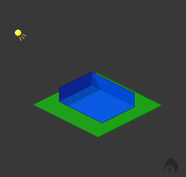
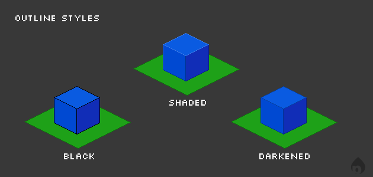

# Chapter 3: Colors, Outlines, and Lighting

Using and selecting the correct colors to use for your isometric pixel art is one of the most important aspects of the overall work. Shading your work can mean more than simply darkening or lightening your main color. The hues and colors chosen determine the look and feel if your scene. Imagine your building or scene as it would look right in front of you. Whether it's bright plastic style, mid-tone natural colours, or even monochrome, it's entirely up to you.

[TOC]

### Lighting

3.1: A scene lit from the top-left.

Unless you want all your pixel art to look flat, you will need to consider lighting. Color ties closely with lighting, as presenting the illusion of a light source is simply a matter of using lighter and darker color values. Most pieces use a single light source for simplicity, but if you are feeling adventurous and know what you're doing, you can try more than one.

To incorporate lighting, you first need to choose a light source. Most of the time, this will be the top left or top right of your drawing. Since this is isometric art, you do not need to worry about the lighting angle, as there is no real perspective. All objects in your scene should be lit from exactly the same direction.

### Outlines and Highlighting

Outlining and highlighting your buildings and objects makes them stand out more, and gives them a more polished look. Black outlines help distinguish objects from the background, but have the side effect of making the art appear more cartoonish in appearance. Highlights create a more convincing illusion of a third dimension by emphasizing the light source.

Choosing the type of outline is the point you decide on the style you are shooting for. As stated previously, black outlines give your scenes a cartoonish feel, particularly when combined with bright, saturated colors. Shaded outlines are comprised of the base color, but darkened. This has the benefit of providing a defining outline, but without popping the art off the page like a black outline would.

3.2: Three examples of object outlining.

