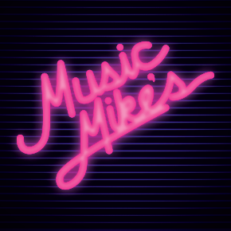
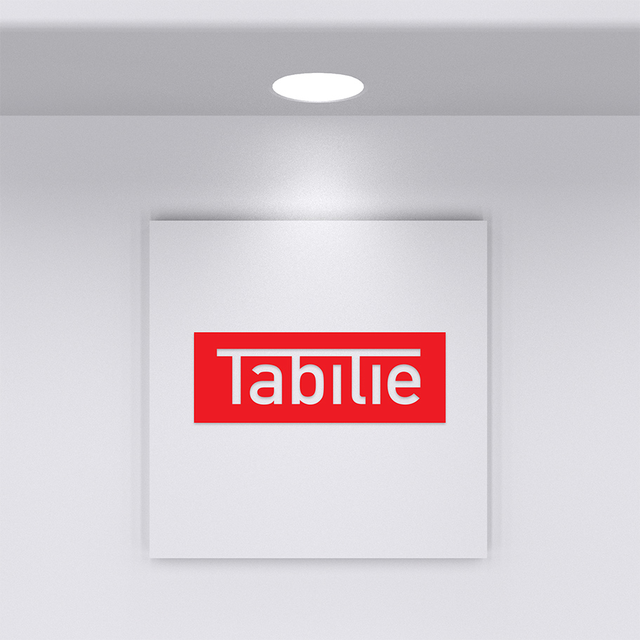
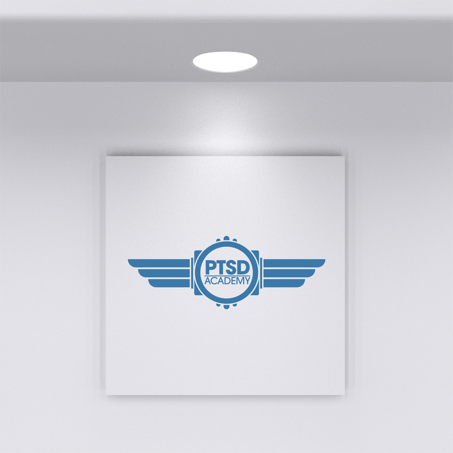
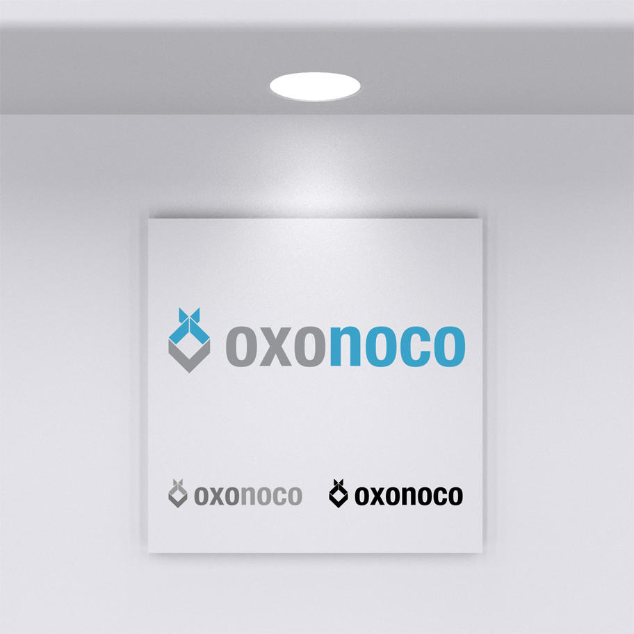
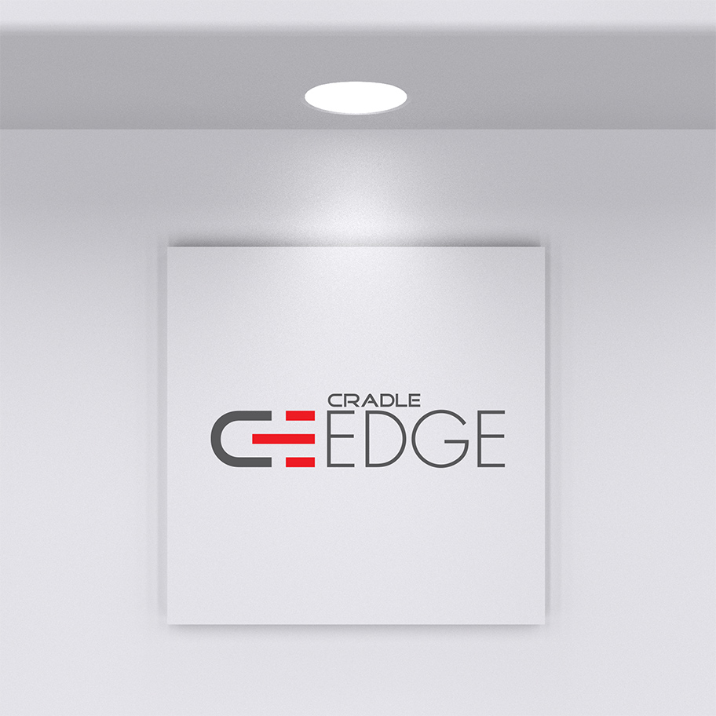
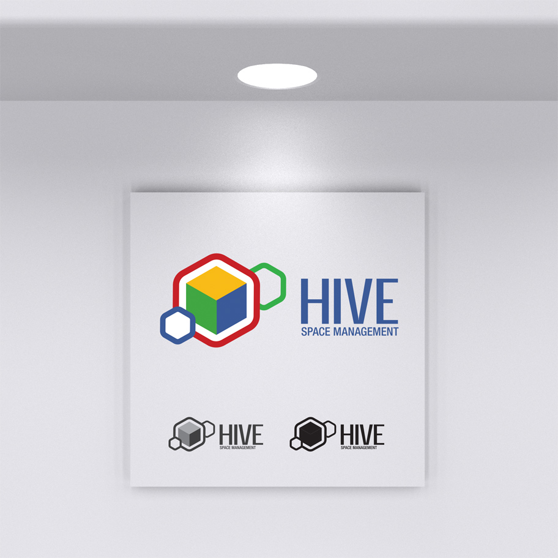
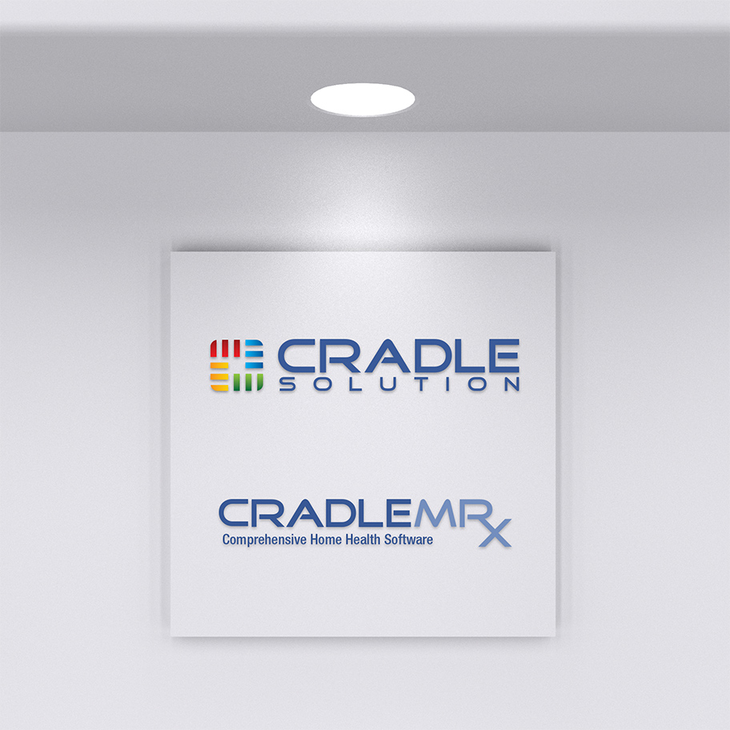

# Logos and Branding

I provide unique, handcrafted logos to match the desires of my clients.

- 
    - The client (me, in this case) wanted a logo that reflected a childhood spent in the 80s staring at glowing neon and chrome.

        I buy and sell used vinyl records in my spare time, many of which came from the same era. This neon-on-lines design scores on all fronts: it's cool, sleek, 80s as hell, and customers love it.
    - Tools: Adobe Illustrator, Adobe Photoshop
    - Colors: #000 #fff
- 
    - Client asked for a basic type-based logo combining the ascenders of the full-height letters to form a table. Once the letterforms were established and approved by the client, I began working on color and style.

        Client also provided for reference the Ferrari logo. Color and style were suited to match, and client signed off happy.
    - Tools: Adobe Illustrator
    - Colors: #000 #fff
- 
    - Asked to provide a logo incorporating "a retro, yet modern style." I created a logo using art deco stylings with some sharper curves to bring a more modern and sleek appearance. Quoting the client review: "Michael did a great job of designing and implementing a logo, embedding it in CSS. He also matched the color pallet of my entire Wordpress site to match the logo."
    - Tools: Adobe Illustrator
    - Colors: #000 #fff
- 
    - I was asked to supply a logo for a new startup company focused on corporate training for the oil and gas industry.

        An invoice matching the new brand was created as part of this initial branding pass.
    - Tools: Adobe Illustrator
    - Colors: #000 #fff
- 
    - Client was launching a brand new business-to-business software platform, and wanted a brand that emphasized its connectivity and modern feel.

        The end logo communicates connectivity through its matching C and E letterforms. The colors and clean lines convey a modern sensibility that matches the product name.
    - Tools: Adobe Illustrator
    - Colors: #000 #fff
- 
    - Client was launching a new workplace management platform and wanted to encompass multiple aspects of business management into a single cohesive product.

        After consulting with client, the Hive concept was decided on and concepts were developed. The end brand reflects disparate elements coming together into a clean, neat cube. I was able to incorporate existing corporate color identity into this logo as well.
    - Tools: Adobe Illustrator
    - Colors: #000 #fff
- 
    - Client wanted a logo reminiscent of Oracle&#039;s logo. I started with a similar font, and incorporated the idea of multiple products coming together with the four logoform colors.

        The colors were initially solid, but client asked for some gradients to make it stand out more.

        The client also asked for a matching logo for the flagship product, CradleMRx. I used the same font and created the Rx as a ligature to show its relevance to the medical industry.
    - Tools: Adobe Illustrator
    - Colors: #000 #fff

