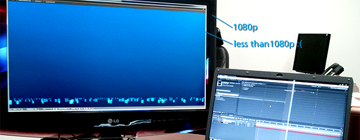
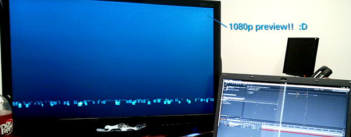

If you actually bother preemptively reading your software documentation, you may have already known this, but this is a huge time-saver over having to render test movies for my HDTV.

At work, I'm using a 27&#8243; 1080p monitor/television as my secondary monitor. We use a model that has a similar color profile for presentations, so using this screen as a preview screen is essential. Otherwise, we'd have to keep our presentation displays unpacked and hooked up to a computer, transfer files, and so on. I won't get into (more) details, but suffice to say it would be a royal pain.

You can stretch to the edges, but there's still a border.

Even with this setup, I've been rendering drafts to an mp4 file and running a video player fullscreen on the HDTV (which matches the production environment). This is still a step I'd rather not have to do, so finally today I did some searching.

&#8216;Lo, and behold! There _is_ a way.

According to Adobe documentation, Ctrl+\ (⌘+\ on Mac) does the following:

> Resize application window or floating window to fit screen. (Press again to resize window so that contents fill the screen.)

Since my composition window is on the second monitor already, I pressed Ctrl+\ twice.

Ah, fullscreen goodness.

