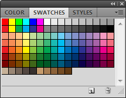

Everybody wants a rainbow, apparently.

Whether you're trying to save a specific set of colors for later use, or simply want a palette with only your colors on it, you'll likely have encountered a problem that has been plaguing Photoshop for as long as I remember, and still hasn't been addressed in CS5 (or CS5.5, that I know of): **how do you clear the swatch palette**?

The only things you _can_ do from Photoshop's own menus are:

* reset the swatch palette to the default colors
* replace the palette with a new swatch palette by selecting "Replace Swatches."

Anyway, there are two ways to clear the swatch palette completely. Actually, there are three, but one of those is to manually right-click each swatch and select "Delete swatch". If you've got way too much time on your hands, this would be the way to go. For the rest of us that would rather get on with our lives, there are two better methods of clearing out the palette.

The first method is to do it manually, only with the help of a keyboard shortcut. While holding your mouse cursor over the swatch palette, hold down Alt (⌥ Option on Mac). Your cursor should change to a scissors icon (). Click any color in the swatch palette to delete it. You'll have to do this over a hundred times to clear out the palette, but if you're a furious clicker like me, you can have this done in under 10 seconds (I play Starcraft, so…yeah).

The Alt/⌥ Option clicking works fairly well, but is still somewhat labor intensive. If you want to clear it even faster, you can download [this (mostly empty) swatch file](/downloads/single_swatch.aco). It includes only one color, black, so you can simply delete this single swatch and begin filling the palette with your own colors.

Download the file below:

[single_swatch.aco](/downloads/single_swatch.aco) (50 bytes)