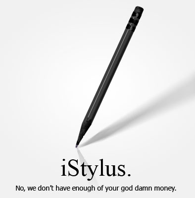

**Note from 2024:** In retrospect hilarious because I: 1) own an Apple Pencil, and 2) plan on buying another one.

Based on a conversation with a buddy this morning:

> **Michael:** (after reading [this iPad review](http://www.thekmiecs.com/misc/real-ipad-review/)) could you imagine walking into someone's house where they used their ipad as a $500 picture frame, all the time? I think I'd punch them in the face  
> **Steve:** I wouldn't &#8211; I would sell them a iPad stylus for $100 (it would be a standard #2 pencil)  
> **Michael:** LOL &#8230;be sure to put shiny black plastic on it  
> **Steve:** $150 for for the "distressed" stylus (chewed up pencil)

iDistressed: Only $149.99!

