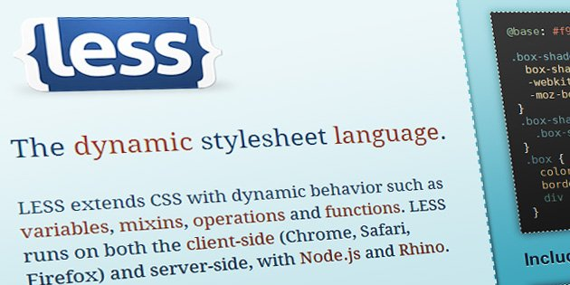
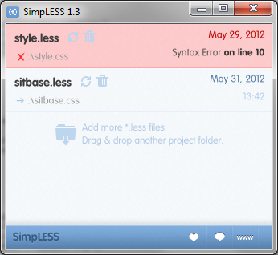

When I first took a look at LESS as a CSS replacement, I wasn't too interested in having even a command-line compiler. The idea of having my stylesheet loaded and parsed by Javascript didn't sound that great either, but tolerable if it saved me enough time and effort writing CSS.



While testing LESS on my local server, I used `less.js` to process my `.less` stylesheet on the client side. It worked well, and on modern browsers the processing time is minimal, but I decided to look around for LESS compilers anyway. I discovered [http://wearekiss.com/simpless](SimpLESS) nearly immediately, and it looked perfect.

Compiling a `.less` file is as easy as drag-and-drop, and it monitors the file for changes. When your file is saved, it is nearly immediately compiled into a CSS file. If you've made an error in your file, the file highlights red and specifies the line number at which the problem occurred. Output is pure, minified CSS goodness.

SimpLESS, by default, inserts a comment at the top referring to its website. This can easily be disabled if you like.

When I first started using SimpLESS, I was copying and pasting the output into a WordPress template style.css file, which requires a properly-formatted comment at the top to describe the theme. Since SimpLESS performs minification, comments are stripped out. I thought this was the only way to keep my WordPress theme comment intact while still using the features of LESS. This copy-paste tedium was something I specifically wanted to avoid in the first place.

**Note: The remainder of this post was written before SimpLESS users complained enough about this very issue, so theme comment preservation is no longer an issue.**

I thought that there must be some way to preserve a comment when compiling. Surely that wasn't an uncommon use case? I checked out the [https://github.com/Paratron/SimpLESS](SimpLESS source code) to see how it was performing its minification (`master/Resources/js/clean_css.js, line 30` if you're interested), and saw they included a special character to preserve certain comments: the exclamation mark.

To preserve a CSS comment in SimpLESS (not that this will not work using the Javascript version, as WordPress will not find a `style.less` file), simply put an exclamation point after the initial comment delimiter, like so:

```css
/*!
Theme Name: My Super-Cool Theme
Theme URI: https://www.pixelbath.com/
Description: Blah blah blah...
[cut for length]
*/
```

The exclamation point is ignored by WordPress, and if you have SimpLESS processing your `style.less` file, you can continue to upload your theme's `style.css` file as usual.